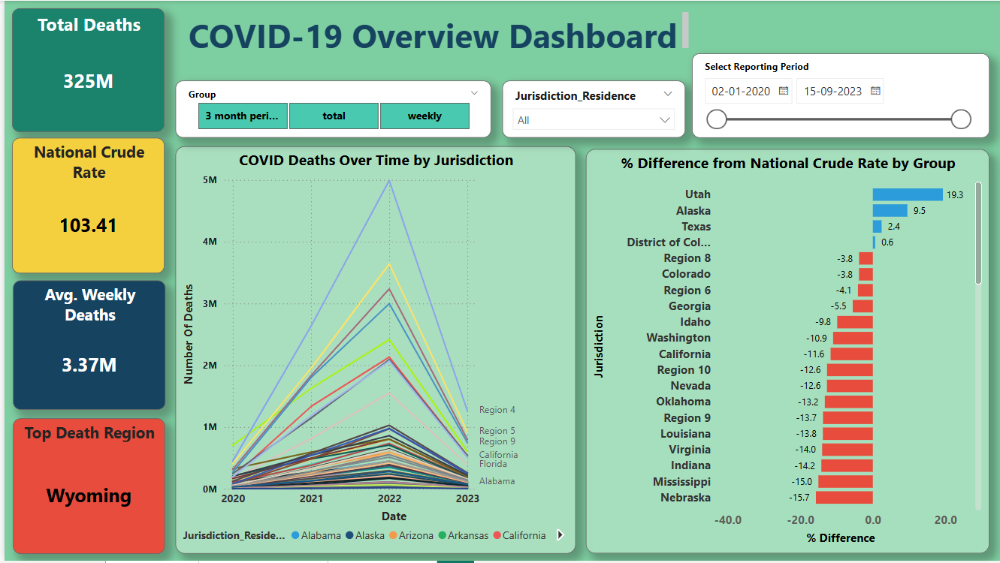
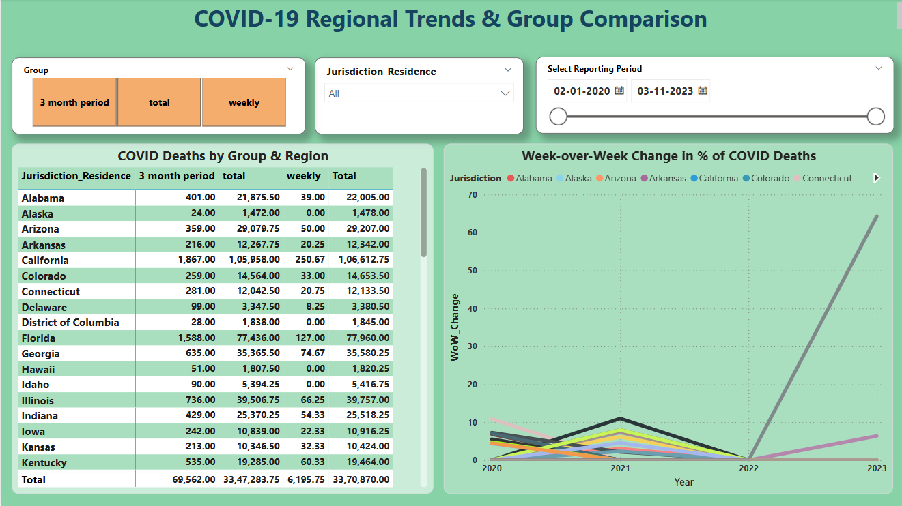
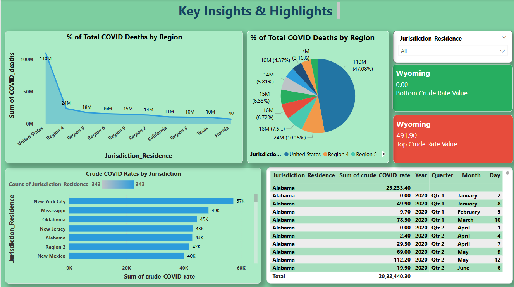

# Pandemic-Mortality-Trend-Analysis-Covid-19-Deaths

# 🦠 COVID-19 Data Analytics & Dashboard Case Study

A complete SQL + Power BI project that analyzes COVID-19 crude death rates, weekly mortality trends, and jurisdictional insights across the United States. This case study applies data engineering, DAX modeling, and visualization best practices to surface critical public health patterns.

---

## 📊 Project Highlights

- ✅ Built a fully interactive Power BI dashboard
- ✅ Cleaned and prepared data using SQL Server
- ✅ Created advanced KPIs using DAX (e.g., week-over-week % change, avg deaths)
- ✅ Enabled regional & group-based drilldowns using slicers and bookmarks
- ✅ Styled with UX best practices and dashboard storytelling

---

## 📌 Objectives

- Analyze regional trends in COVID-19 crude death rates
- Identify high and low-performing jurisdictions
- Track week-over-week changes and 4-week averages
- Compare jurisdictions against national crude rate benchmarks
- Present insights through a user-friendly Power BI interface

---

## 📥 SQL Business Questions Answered

1. **Which jurisdiction had the highest number of COVID deaths?**
2. **Who deviated most from the national average crude rate?**
3. **What was the average weekly death rate (last 4 periods)?**
4. **What’s the cleanest latest snapshot of deaths (excluding 0 or NULL)?**
5. **How did COVID % share change week-over-week (post Mar 1, 2020)?**
6. **What’s the cumulative death toll per jurisdiction to date?**

---

## 📈 Dashboard Snapshots

### 🔹 Page 1 – Overview Dashboard
> 

### 🔹 Page 2 – Regional Trends
> 

### 🔹 Page 3 – Key Insights & Rankings
>

---

## 🧠 Key Insights

- Wyoming consistently ranks highest in crude COVID death rate  
- Utah, Alaska, and Texas show higher-than-average crude rates  
- Week-over-week spikes align with 2021–2022 COVID waves  
- Top 5 jurisdictions contribute over 40% of national deaths  
- Bookmark toggles improve visual comparison across regions  

---

## 📤 Final Dashboard (Power BI)

The interactive Power BI dashboard features:

- 🟩 Dynamic KPI cards with color-coded metrics  
- 📈 Line chart tracking weekly deaths over time  
- 📊 % Difference bar charts vs national average  
- 🔁 Toggle buttons for pie chart vs matrix views  
- 🔎 Drilldowns using slicers for Jurisdiction, Group, and Date  

---

## 📎 Case Study Presentation

View the full walkthrough and insights here:  
🔗 [Download Project PPT](https://github.com/Amiya-git04/Pandemic-Mortality-Trend-Analysis-Covid-19-Deaths/blob/main/Covid_deaths_presentation_case_study.pbix)

